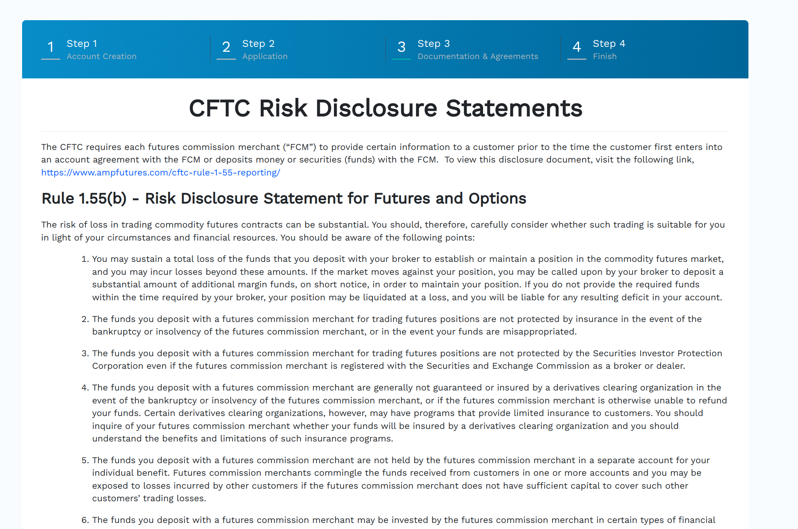

# AMP Futures

AMP futures is a popular futures brokers.
The reason we chose it is because they support Metatrader5.
While other trading software can be really powerful for daytraders (ninjetrader, quantower, etc...) they are however very complex (if not impossible) to use in a pure algorithmic way.
That is primarly because most work on windows only.
Metatrader also needs windows, however wine support is robust and mature.

## Creating an AMP futures account :material-alert-decagram:{ .mdx-pulse title="Added on Aug 08, 2023" }
Before getting started, it is important to note that AMP has 2 branches:
+ AMP futures is based in the US and allows only futures trading
+ AMP Global is based in the EU, allows for futures and CFD's
The reason why we choose AMP futures is because of their flexible fee structure, both in commissions and withdrawal fees.

### 1. Creating the Account
Header over to AMP futures [signup page](https://www.ampclientportal.com/Identity/Account/Register) and create a new account.

<figure markdown>
  { width="90%" }
  <figcaption>Registration Page</figcaption>
</figure>

### 2. Confirm Email
AMP will send you an email requesting to confirm your email address.

<figure markdown>
  { width="90%" }
  <figcaption>Confirmation Email</figcaption>
</figure>

### 3. Dashboard
You will find yourself landing on the dashboard.
Please, click on the button `Start New Application`
<figure markdown>
  { width="90%" }
  <figcaption>Dashboard</figcaption>
</figure>

### 4. Filling the application
You will now start filling an application. You will be asked various questions which are a mix of KYC and questions related to your trading experience.
You will also need to sign on documents presented by the CFTC. 
 
There is no repercussions if you sign these documents.
You are signing them to say that you are aware that your are opening a speculative account, and that you could lose money are a result.
<figure markdown>
  { width="90%" }
  <figcaption>Dashboard</figcaption>
</figure>

### 5. Application steps
<figure markdown>
  { width="90%" }
</figure>
<figure markdown>
  { width="90%" }
</figure>
<figure markdown>
  { width="90%" }
</figure>
<figure markdown>
  { width="90%" }
</figure>
<figure markdown>
  { width="90%" }
</figure>
<figure markdown>
  { width="90%" }
</figure>
<figure markdown>
  { width="90%" }
</figure>
<figure markdown>
  { width="90%" }
</figure>
<figure markdown>
  { width="90%" }
</figure>
<figure markdown>
  { width="90%" }
</figure>
<figure markdown>
  { width="90%" }
</figure>
<figure markdown>
  { width="90%" }
</figure>
<figure markdown>
  { width="90%" }
</figure>
<figure markdown>
  { width="90%" }
</figure>
<figure markdown>
  { width="90%" }
</figure>
<figure markdown>
  { width="90%" }
</figure>
<figure markdown>
  { width="90%" }
</figure>
<figure markdown>
  { width="90%" }
</figure>
<figure markdown>
  { width="90%" }
</figure>
<figure markdown>
  { width="90%" }
</figure>
<figure markdown>
  { width="90%" }
</figure>
<figure markdown>
  { width="90%" }
</figure>
<figure markdown>
  { width="90%" }
</figure>
<figure markdown>
  { width="90%" }
</figure>
<figure markdown>
  { width="90%" }
</figure>
<figure markdown>
  { width="90%" }
</figure>

## 6. Waiting for approval
Assuming you have provided all the information, you now need to wait for the approval by AMP.
They might request further documents, especially in relation to the source of funds.
Please, make sure to keep an eye to your registered email for any inquiries.
