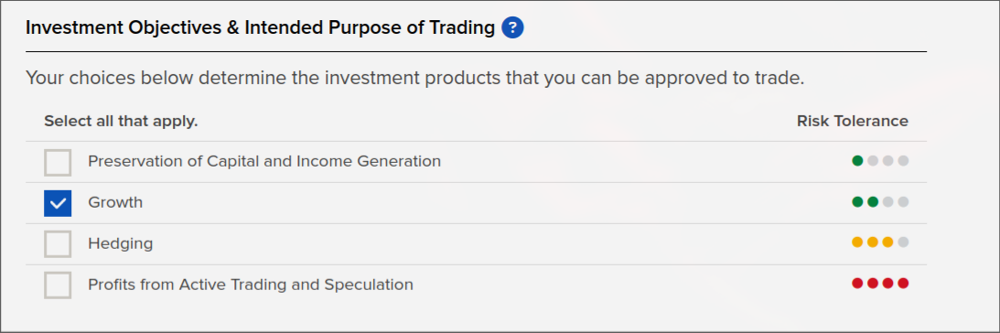
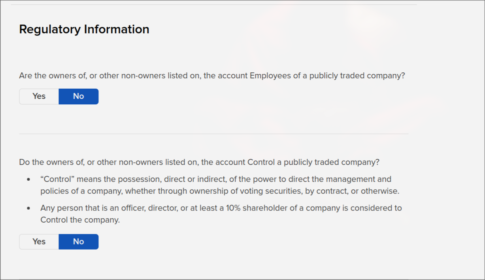

# Interactive Brokers

Interactive Brokers (IBKR) is a very popular all around established broker. It has access to a wide range of markets, and offers competitive fees.
While RocketBot was not built to trade on IBKR, it is still possible to use it via Collective 2.

## Create an Interactive Brokers Account
IBKR supports multiple type of accounts. Assuming you have no account created and would like to create a new one, we recommend you create an "Individual Investor or Trader" account as shown in the figure below.

<figure markdown>
  { width="90%" }
  <figcaption>IBKR Account selection</figcaption>
</figure>

## Starting a new Application

Head over to the "[Open Account](https://ndcdyn.interactivebrokers.com/Universal/Application)" page and start a new application.

<figure markdown>
  { width="90%" }
  <figcaption>Start Application</figcaption>
</figure>

## Fill out the application
### 1. Select account type

Make sure to select an `Individual` account type.

<figure markdown>
  { width="90%" }
  <figcaption>IBKR Account selection</figcaption>
</figure>

### 2. Personal information

Fill in your personal information

<figure markdown>
  { width="90%" }
  <figcaption>Fill in personal information</figcaption>
</figure>

### 3. Configure Trading account

You will now be asked questions that are meant to determine your level of experience with trading in general.
Be as honest as you can, however, be advised that if your liquid net worth is less than 50,000$ IBKR will not allow you to trade futures, which are the products traded by Rocket Bot.

<figure markdown>
  { width="90%" }
  <figcaption>Trading Account info</figcaption>
</figure>

-----

Make sure to choose growth in the investment objectives section.

<figure markdown>
  { width="90%" }
  <figcaption>Investment objectives</figcaption>
</figure>

-----

Futures are not picked by default. Make sure to add them from the dropdown, and fill in the information similar to the picture

<figure markdown>
  { width="90%" }
  <figcaption>Trading Experience</figcaption>
</figure>

-----

Make sure to say no for these questions.

<figure markdown>
  { width="90%" }
  <figcaption>Regulatory information</figcaption>
</figure>

### 4. Aggrements

Make sure to agree to all aggrements

<figure markdown>
  { width="90%" }
  <figcaption>Aggrements</figcaption>
</figure>

### 5. Status
 
You will need to upload passport and bank statements in order to have your account approved.

IBKR might request for more documents along the way. Please make sure to submit them.

