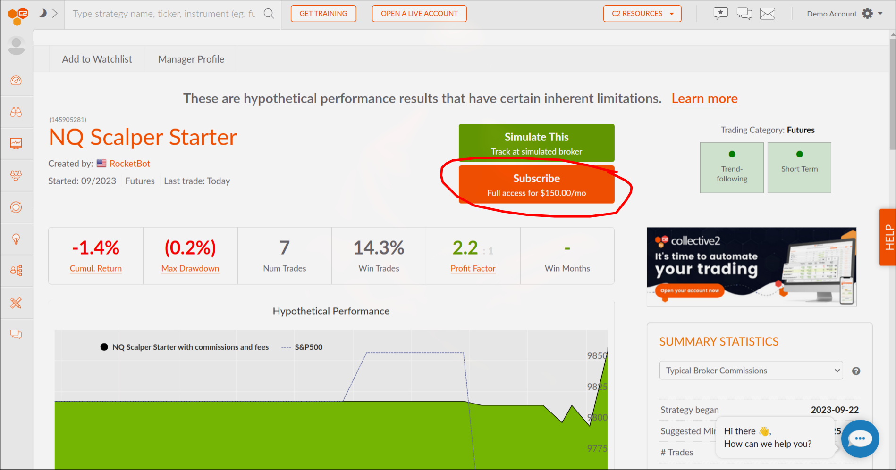
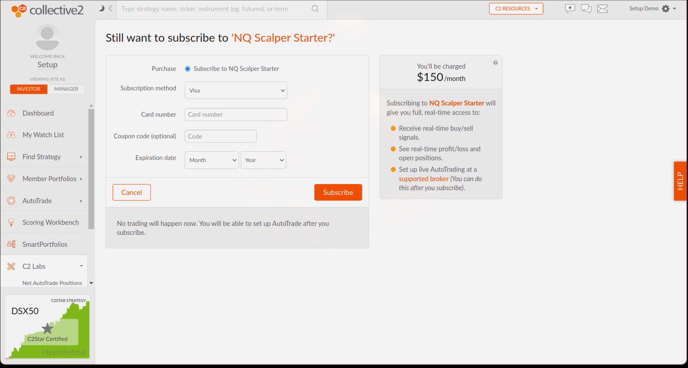
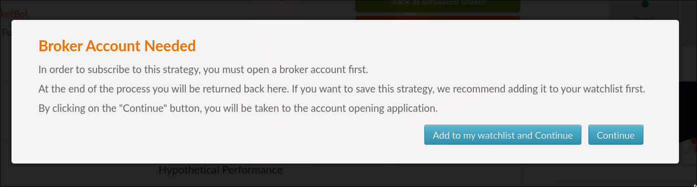
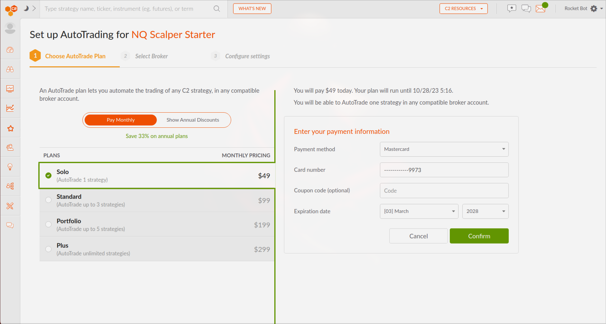
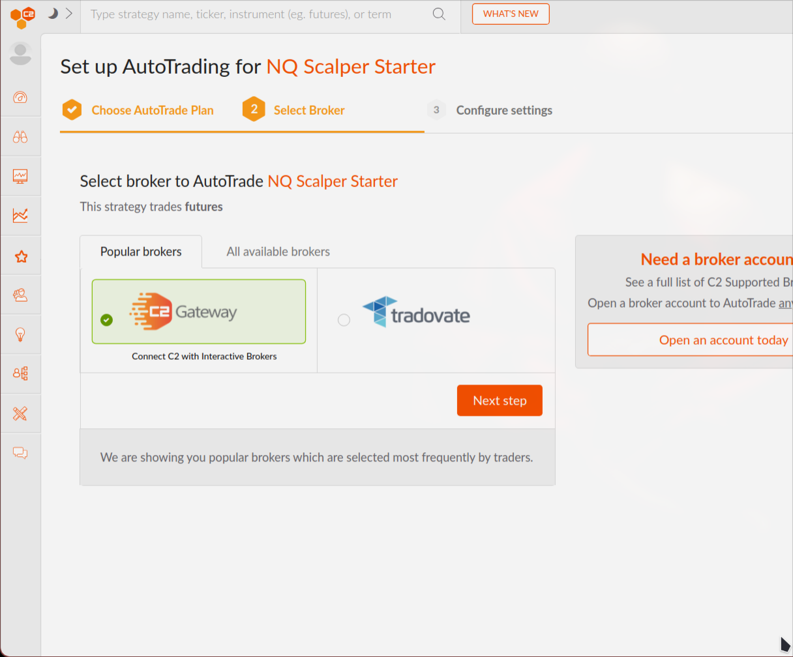
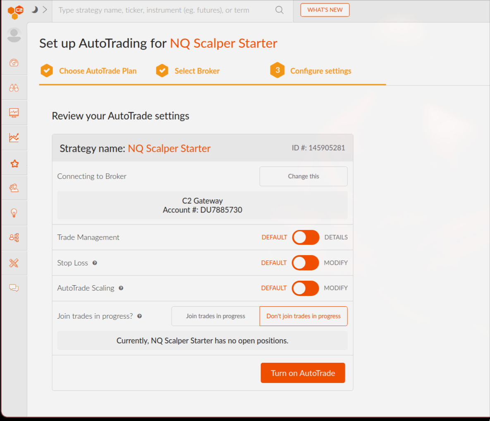
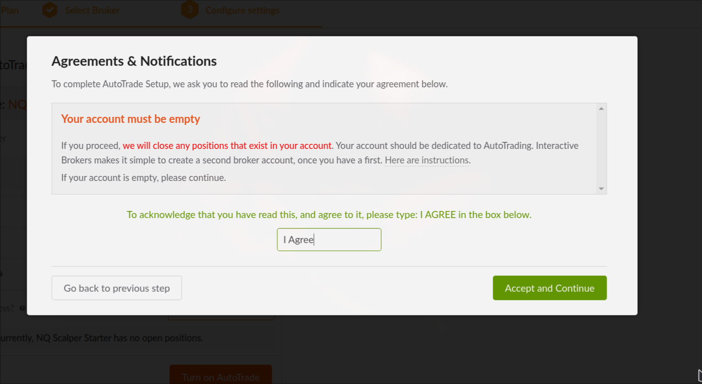
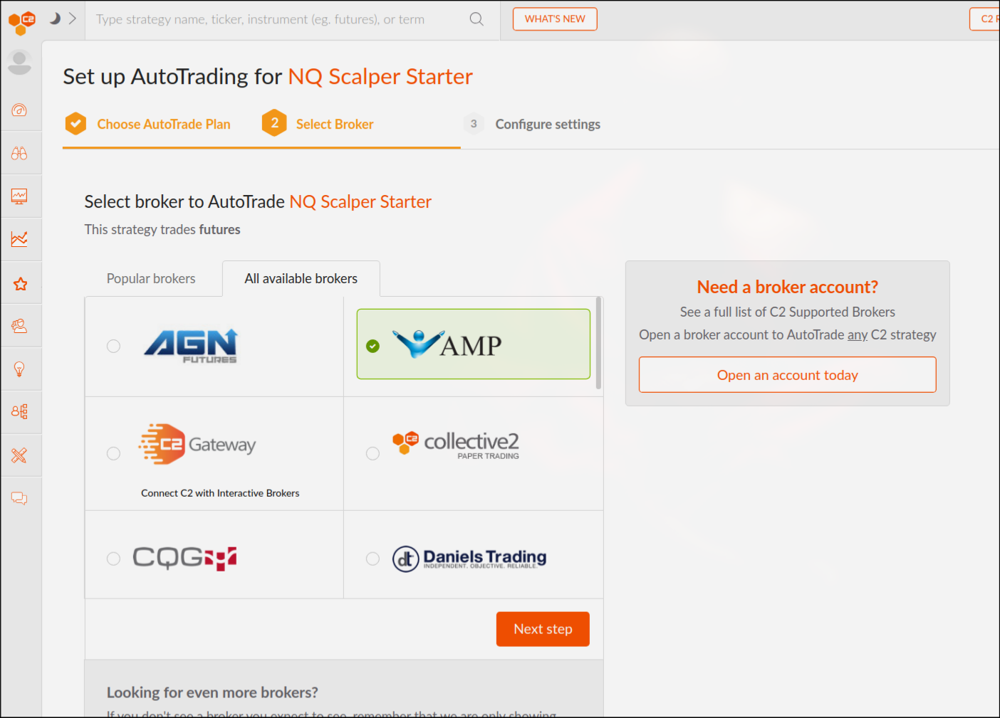
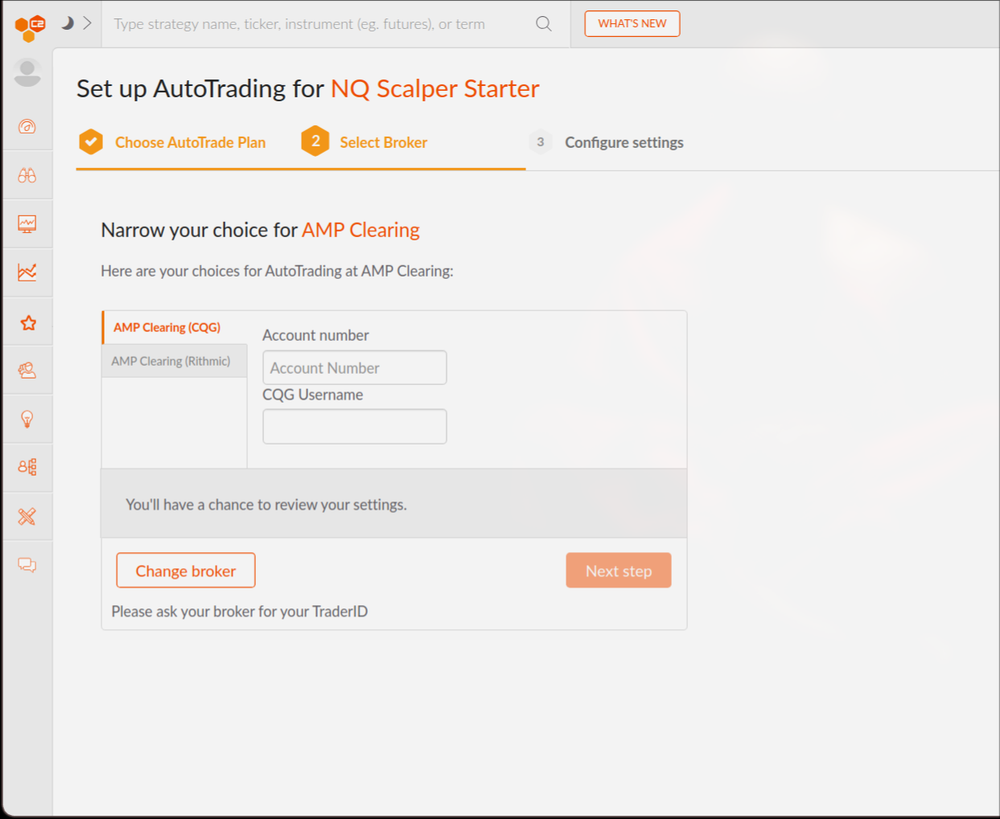

# Connect Broker to C2

One you have created a [brokerage account](/brokers), and a [C2 account](/howto/collective2_setup), follow these steps to connect the bot to the strategy.

## Subscribe to the strategy

First, subscribe to our flagship strategy: [Rocket Bot Starter](https://collective2.com/details/145905281).

Once you land on the strategy page, make sure to click on the Subscribe button.

<figure markdown>
  { width="90%" }
  <figcaption>Subscribe to Strategy</figcaption>
</figure>

You will then be redirected to purchase the strategy

<figure markdown>
  { width="90%" }
  <figcaption>Subscribe to Strategy</figcaption>
</figure>

You will be told that you to setup Autotrader to connect your broker.

<figure markdown>
  { width="90%" }
  <figcaption>Connect your broker</figcaption>
</figure>

## Setup Autotrade

The first thing you need to do is setup and pay for Auto-Trade.

AutoTrade, is a feature created and maintained by Collective2 that allows you to choose any strategy on their website, subscribe to it, and connect ti directly to your broker account. No more setup required on your behalf, and you do NOT need to move your funds outside of your own trading accounts.

<figure markdown>
  { width="90%" }
  <figcaption>Setup AutoTrader</figcaption>
</figure>

## Connect brokerage account
### Setup IBKR Connection

Once you setup Autotrading, you have to select the Gateway option as this is the one that connects to IBKR.

<figure markdown>
  { width="90%" }
  <figcaption>Choose Gateway</figcaption>
</figure>

Now update the settings to your taste, or leave the default as is.

<figure markdown>
  { width="90%" }
  <figcaption>Check the settings</figcaption>
</figure>

Finally, you will have to agree on a bunch of terms and conditions.

<figure markdown>
  { width="90%" }
  <figcaption>Check the settings</figcaption>
</figure>

### Setup AMP Connection

Setting AMP is similar, but it requires your CQG account, and MT5 account, which you are given when creating the account.

<figure markdown>
  { width="90%" }
  <figcaption>Select AMP</figcaption>
</figure>

<figure markdown>
  { width="90%" }
  <figcaption>Enter CQG and AMP account numbers</figcaption>
</figure>

