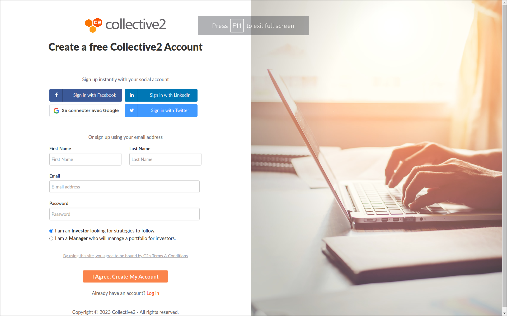
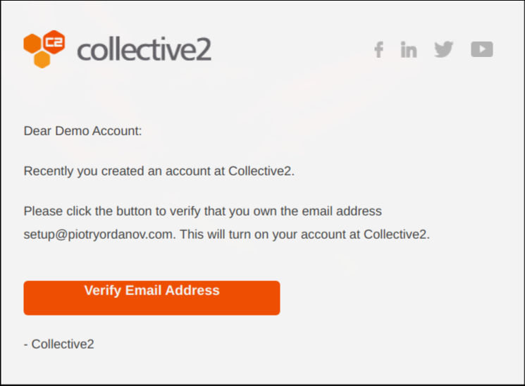
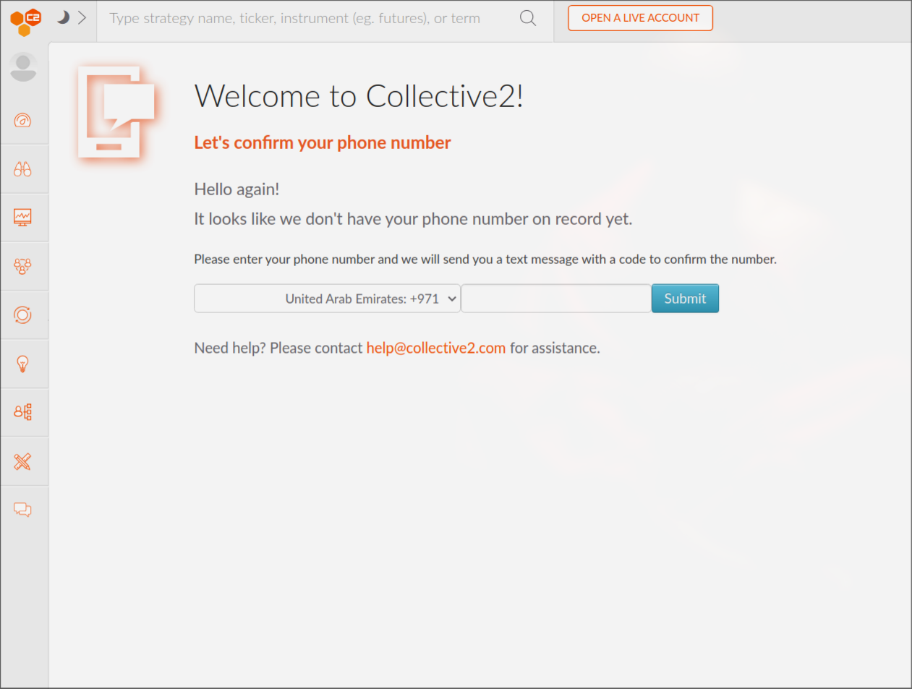

# Collective 2  Setup

##  What and why Collective 2
[Collective 2](https://collective2.com/) is a platform that allows you to follow and automatically copy the trades of other traders. 
We are using it because it simplifies a lot of the hurdles we might face when offering our trading robots.
Here's key facts to know:

1. With collective 2, you do NOT have to give us your money. It stays safely in your brokerage account.
2. Collective 2 charges a fee in order to connect to your brokerage account and mirror the trades from rocket bot
3. We charge a flat monthly fee in order to manage your strategy. 
   
Traditional hedge fund charge a 2% management fee regardless of performance, and then take around 20% of the profits they generate to you.
With Collective 2, you don't get charged the 20% performance fee, and the management fee is not a function of capital but a flat monthly fee!

## Collective 2 account creation

Creating an account on collective 2 is relatively easy. Head over to their [website](https://collective2.com/securesignup) and create an account.
Make sure to tick the **investor** box.

<figure markdown>
  { width="90%" }
  <figcaption>Account Creation</figcaption>
</figure>

Once you are done, you will receive an email to verify your account. Click on the link and you will be redirected to the collective 2 website.

<figure markdown>
  { width="90%" }
  <figcaption>Email Verification</figcaption>
</figure>

The last step will be phone verification.

<figure markdown>
  { width="90%" }
  <figcaption>Phone Verification</figcaption>
</figure>

## Broker Connection

Once you have created your account and succesfully verified it, it is time to connect it to your broker.
Head over [here](/howto/collective2_connect) for instructions.
